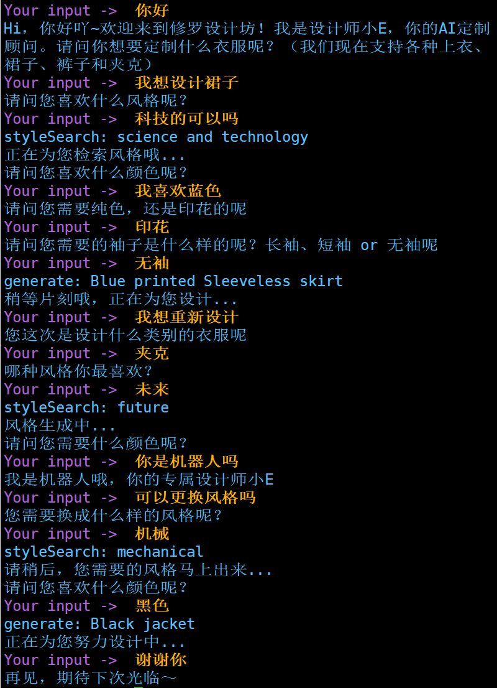

# fashion-chatbot-paddlenlp
基于rasa 2使用PaddleNLP搭建时尚对话系统

## 主要功能
* 通过对话获取客户服装设计的需求
* 通过对话获取客户风格的需求
* 下游接风格与服装的跨模态检索模块
* [使用PaddleCLIP, Milvus搭建跨模态时尚搜索引擎](https://aistudio.baidu.com/aistudio/projectdetail/2299929?contributionType=1&shared=1)
* [使用PaddleCLIP搭建跨模态时尚搜索引擎](https://aistudio.baidu.com/aistudio/projectdetail/2317276)

## 数据
* [Chatito](https://rodrigopivi.github.io/Chatito/) 生成

## 环境版本
* python==3.8
* rasa==2.8.4
* paddlepaddle==2.0.2
* paddlenlp==2.0.0rc20
* markdownify==0.9.2
* PyExecJS==1.5.1
* numpy==1.18.5
* pandas==1.3.1

## 训练
```
rasa train -c config.yml --data data/training_dataset_1631021066.json data/stories.md --out models/ --domain domain.yml --num-threads 10 --augmentation 100 -vv
```

## 开启服务
```
rasa run actions --actions actions.actions --cors "*"
rasa shell -m models/20210908-014337.tar.gz --endpoints endpoints.yml
```

## 效果


## 项目参考
* [appointment-bot](https://github.com/lhr0909/appointment-bot)
* https://aistudio.baidu.com/aistudio/projectdetail/1899120
